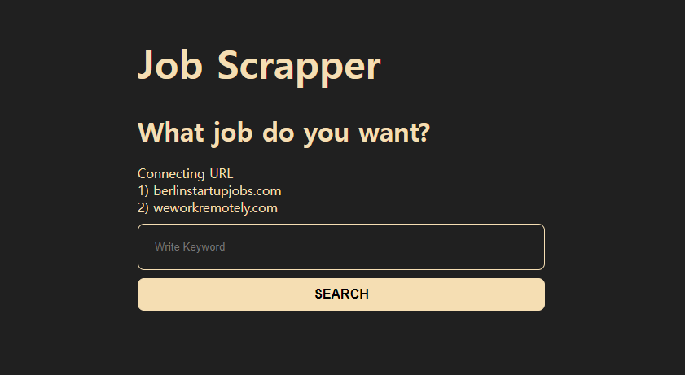
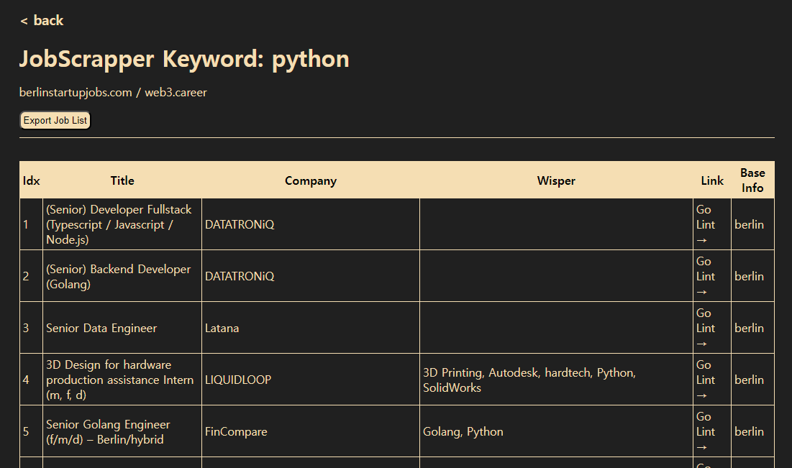

# flask-jobscrapper

### 기능
    - flask 구현
    - BeautifulSoup 스크래핑(user-agent활용)        
        - "https://berlinstartupjobs.com/skill-areas/"
        - "https://web3.career"
    - scraping 결과 > file(csv) download
    - fake db 생성: 한번 스크래핑 한 결과 저장 하여 검색 속도 향상

### 구성
    - inspectors
        - berlin.py: berlin URL 관련 함수
        - web3.py: web3 URL 관련 함수
    - static: css 관리
    - templates: 라우팅 경로별 html
        - home.html: home화면
        - searchList.html: 스크래핑 결과

### 화면

